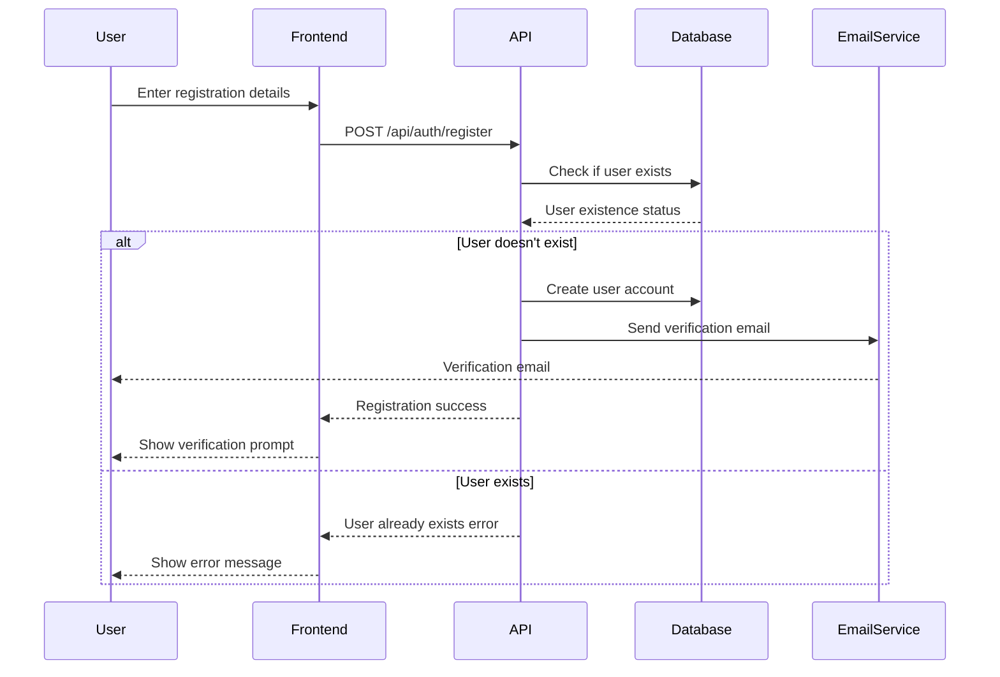
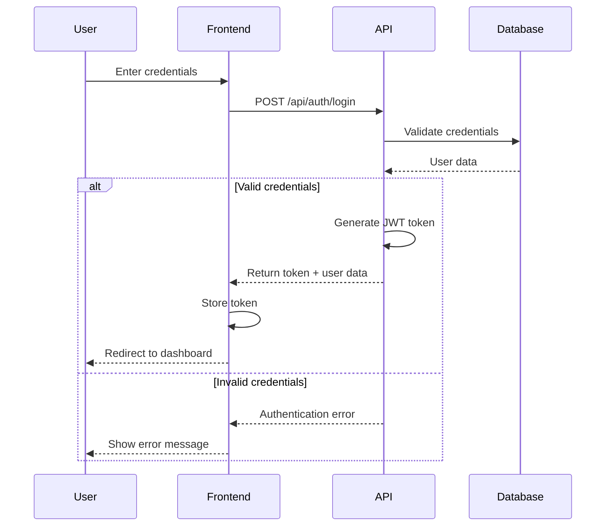
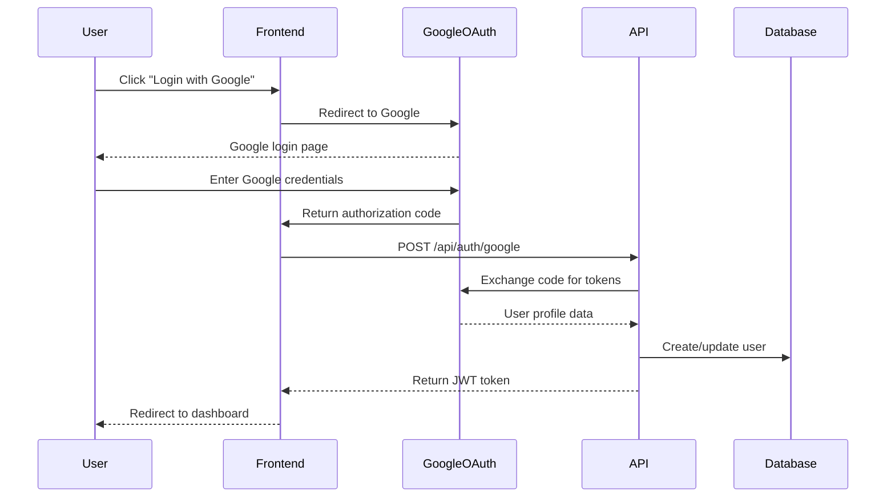

# Authentication System Documentation

This document describes the comprehensive authentication and authorization system used in the InterviewAI platform.

## Overview

The InterviewAI platform implements a multi-layered authentication system with the following features:

- **JWT-based Authentication** - Secure token-based authentication
- **Google OAuth Integration** - Social login with Google
- **Two-Factor Authentication (2FA)** - Email-based OTP verification
- **Role-Based Access Control (RBAC)** - Admin and User roles
- **Session Management** - Secure session handling with refresh tokens
- **Admin Impersonation** - Secure user impersonation for support

## Authentication Flow

### 1. User Registration Flow



### 2. Login Flow



### 3. Google OAuth Flow



## Authentication Components

### JWT Token Structure

The platform uses JSON Web Tokens (JWT) for authentication with the following structure:

```typescript
interface JWTPayload {
  userId: string;
  email: string;
  role: 'user' | 'admin';
  iat: number; // Issued at
  exp: number; // Expiration time
  sessionId?: string; // Optional session identifier
}
```

**Token Configuration:**
- **Algorithm**: HS256
- **Expiration**: 24 hours for access tokens
- **Refresh Token Expiration**: 30 days
- **Secret**: Stored in environment variables

### User Roles and Permissions

#### User Role (`user`)
**Permissions:**
- Access user dashboard
- Create and manage own interviews
- Chat with AI assistants
- View own analytics and feedback
- Update own profile
- Practice with question bank

**Restricted Actions:**
- Cannot access admin dashboard
- Cannot manage other users
- Cannot view system analytics
- Cannot impersonate other users

#### Admin Role (`admin`)
**Permissions:**
- All user permissions
- Access admin dashboard
- Manage all users (view, block, activate)
- View system analytics and metrics
- Impersonate other users
- Manage question bank
- Export system data
- Configure platform settings

**Special Admin User:**
- **Email**: `alpsingh03@gmail.com`
- **Default Password**: `Aa2275aA`
- **Cannot be deleted or demoted**

### Two-Factor Authentication (2FA)

The platform implements email-based 2FA for enhanced security.

#### 2FA Flow

```typescript
interface TwoFactorAuth {
  email: string;
  otp: string; // 6-digit numeric code
  expiresAt: Date; // 10 minutes from generation
  attempts: number; // Max 3 attempts
  verified: boolean;
}
```

#### OTP Generation and Validation

```typescript
// OTP Generation
const generateOTP = (): string => {
  return Math.floor(100000 + Math.random() * 900000).toString();
};

// OTP Validation
const validateOTP = (inputOTP: string, storedOTP: string, expiresAt: Date): boolean => {
  if (new Date() > expiresAt) return false;
  return inputOTP === storedOTP;
};
```

#### Email Template for OTP

```html
<!DOCTYPE html>
<html>
<head>
    <title>InterviewAI - Verification Code</title>
</head>
<body>
    <div style="max-width: 600px; margin: 0 auto; padding: 20px;">
        <h2>Your Verification Code</h2>
        <p>Your verification code for InterviewAI is:</p>
        <div style="font-size: 32px; font-weight: bold; text-align: center; 
                    padding: 20px; background: #f5f5f5; border-radius: 8px;">
            {{OTP_CODE}}
        </div>
        <p>This code will expire in 10 minutes.</p>
        <p>If you didn't request this code, please ignore this email.</p>
    </div>
</body>
</html>
```

## API Authentication

### Protected Routes

All API routes except authentication endpoints require valid JWT tokens.

#### Middleware Implementation

```typescript
// middleware.ts
import { NextRequest, NextResponse } from 'next/server';
import { verifyJWT } from '@/lib/auth';

export async function middleware(request: NextRequest) {
  const token = request.headers.get('authorization')?.replace('Bearer ', '');
  
  if (!token) {
    return NextResponse.json({ error: 'Unauthorized' }, { status: 401 });
  }

  try {
    const payload = await verifyJWT(token);
    
    // Add user info to request headers
    const requestHeaders = new Headers(request.headers);
    requestHeaders.set('x-user-id', payload.userId);
    requestHeaders.set('x-user-role', payload.role);
    
    return NextResponse.next({
      request: {
        headers: requestHeaders,
      },
    });
  } catch (error) {
    return NextResponse.json({ error: 'Invalid token' }, { status: 401 });
  }
}

export const config = {
  matcher: [
    '/api/user/:path*',
    '/api/interviews/:path*',
    '/api/ai-assistant/:path*',
    '/api/admin/:path*'
  ]
};
```

#### Role-Based Route Protection

```typescript
// lib/auth.ts
export const requireRole = (requiredRole: 'user' | 'admin') => {
  return (handler: NextApiHandler) => {
    return async (req: NextApiRequest, res: NextApiResponse) => {
      const userRole = req.headers['x-user-role'] as string;
      
      if (requiredRole === 'admin' && userRole !== 'admin') {
        return res.status(403).json({ error: 'Insufficient permissions' });
      }
      
      return handler(req, res);
    };
  };
};

// Usage in API routes
export default requireRole('admin')(async (req, res) => {
  // Admin-only logic here
});
```

### Frontend Authentication

#### Auth Context Provider

```typescript
// contexts/auth-context.tsx
interface AuthContextType {
  user: User | null;
  login: (email: string, password: string) => Promise<void>;
  loginWithGoogle: () => Promise<void>;
  logout: () => void;
  register: (userData: RegisterData) => Promise<void>;
  verifyOTP: (email: string, otp: string) => Promise<void>;
  loading: boolean;
  isAuthenticated: boolean;
}

export const AuthProvider: React.FC<{ children: React.ReactNode }> = ({ children }) => {
  const [user, setUser] = useState<User | null>(null);
  const [loading, setLoading] = useState(true);

  // Authentication methods implementation
  const login = async (email: string, password: string) => {
    const response = await fetch('/api/auth/login', {
      method: 'POST',
      headers: { 'Content-Type': 'application/json' },
      body: JSON.stringify({ email, password })
    });

    if (response.ok) {
      const { token, user } = await response.json();
      localStorage.setItem('token', token);
      setUser(user);
    } else {
      throw new Error('Login failed');
    }
  };

  // Other methods...

  return (
    <AuthContext.Provider value={{
      user,
      login,
      logout,
      register,
      verifyOTP,
      loading,
      isAuthenticated: !!user
    }}>
      {children}
    </AuthContext.Provider>
  );
};
```

#### Protected Route Component

```typescript
// components/ProtectedRoute.tsx
interface ProtectedRouteProps {
  children: React.ReactNode;
  requiredRole?: 'user' | 'admin';
  fallback?: React.ReactNode;
}

export const ProtectedRoute: React.FC<ProtectedRouteProps> = ({
  children,
  requiredRole,
  fallback
}) => {
  const { user, loading } = useAuth();
  const router = useRouter();

  useEffect(() => {
    if (!loading && !user) {
      router.push('/auth/login');
    }
  }, [user, loading, router]);

  if (loading) {
    return <LoadingSpinner />;
  }

  if (!user) {
    return fallback || null;
  }

  if (requiredRole && user.role !== requiredRole) {
    return <UnauthorizedMessage />;
  }

  return <>{children}</>;
};
```

## Session Management

### Session Storage

Sessions are stored in MongoDB with the following schema:

```typescript
interface Session {
  _id: ObjectId;
  userId: ObjectId;
  token: string; // Hashed JWT token
  refreshToken: string;
  expiresAt: Date;
  createdAt: Date;
  lastAccessedAt: Date;
  ipAddress: string;
  userAgent: string;
  isActive: boolean;
}
```

### Session Cleanup

Automatic cleanup of expired sessions:

```typescript
// Cleanup job (runs daily)
const cleanupExpiredSessions = async () => {
  await Session.deleteMany({
    $or: [
      { expiresAt: { $lt: new Date() } },
      { isActive: false },
      { lastAccessedAt: { $lt: new Date(Date.now() - 30 * 24 * 60 * 60 * 1000) } }
    ]
  });
};
```

## Admin Impersonation

### Impersonation Flow

```typescript
interface ImpersonationSession {
  adminId: ObjectId;
  targetUserId: ObjectId;
  impersonationToken: string;
  startedAt: Date;
  expiresAt: Date; // 1 hour max
  reason?: string;
}
```

### Impersonation API

```typescript
// POST /api/admin/impersonate
export default requireRole('admin')(async (req, res) => {
  const { userId, reason } = req.body;
  const adminId = req.headers['x-user-id'];

  // Create impersonation session
  const impersonationSession = await ImpersonationSession.create({
    adminId,
    targetUserId: userId,
    impersonationToken: generateImpersonationToken(),
    startedAt: new Date(),
    expiresAt: new Date(Date.now() + 60 * 60 * 1000), // 1 hour
    reason
  });

  res.json({
    success: true,
    impersonationToken: impersonationSession.impersonationToken
  });
});
```

### Impersonation Banner Component

```typescript
// components/admin/ImpersonationBanner.tsx
export const ImpersonationBanner: React.FC = () => {
  const { impersonationData, stopImpersonation } = useImpersonation();

  if (!impersonationData) return null;

  return (
    <Alert severity="warning" sx={{ mb: 2 }}>
      <AlertTitle>Admin Impersonation Active</AlertTitle>
      You are viewing as: {impersonationData.targetUser.name} ({impersonationData.targetUser.email})
      <Button onClick={stopImpersonation} size="small" sx={{ ml: 2 }}>
        Stop Impersonation
      </Button>
    </Alert>
  );
};
```

## Security Measures

### Password Security

#### Password Requirements
- Minimum 8 characters
- At least one uppercase letter
- At least one lowercase letter
- At least one number
- At least one special character

#### Password Hashing
```typescript
import bcrypt from 'bcryptjs';

const SALT_ROUNDS = 12;

export const hashPassword = async (password: string): Promise<string> => {
  return await bcrypt.hash(password, SALT_ROUNDS);
};

export const verifyPassword = async (password: string, hash: string): Promise<boolean> => {
  return await bcrypt.compare(password, hash);
};
```

#### Password Validation
```typescript
const passwordSchema = z.string()
  .min(8, 'Password must be at least 8 characters')
  .regex(/[A-Z]/, 'Password must contain at least one uppercase letter')
  .regex(/[a-z]/, 'Password must contain at least one lowercase letter')
  .regex(/\d/, 'Password must contain at least one number')
  .regex(/[^A-Za-z0-9]/, 'Password must contain at least one special character');
```

### Rate Limiting

#### Login Attempt Limiting
```typescript
interface LoginAttempt {
  email: string;
  attempts: number;
  lastAttempt: Date;
  lockedUntil?: Date;
}

const MAX_LOGIN_ATTEMPTS = 5;
const LOCK_DURATION = 15 * 60 * 1000; // 15 minutes

export const checkLoginAttempts = async (email: string): Promise<boolean> => {
  const user = await User.findOne({ email });

  if (!user) return true; // Allow attempt for non-existent users (to prevent enumeration)

  if (user.lockUntil && user.lockUntil > new Date()) {
    throw new Error('Account temporarily locked. Please try again later.');
  }

  return true;
};

export const recordFailedLogin = async (email: string): Promise<void> => {
  const user = await User.findOne({ email });
  if (!user) return;

  user.loginAttempts = (user.loginAttempts || 0) + 1;

  if (user.loginAttempts >= MAX_LOGIN_ATTEMPTS) {
    user.lockUntil = new Date(Date.now() + LOCK_DURATION);
  }

  await user.save();
};

export const resetLoginAttempts = async (email: string): Promise<void> => {
  await User.updateOne(
    { email },
    { $unset: { loginAttempts: 1, lockUntil: 1 } }
  );
};
```

#### API Rate Limiting
```typescript
import rateLimit from 'express-rate-limit';

// General API rate limiting
export const apiLimiter = rateLimit({
  windowMs: 15 * 60 * 1000, // 15 minutes
  max: 100, // Limit each IP to 100 requests per windowMs
  message: 'Too many requests from this IP, please try again later.',
  standardHeaders: true,
  legacyHeaders: false,
});

// Strict rate limiting for auth endpoints
export const authLimiter = rateLimit({
  windowMs: 15 * 60 * 1000, // 15 minutes
  max: 5, // Limit each IP to 5 requests per windowMs
  message: 'Too many authentication attempts, please try again later.',
  skipSuccessfulRequests: true,
});
```

### CSRF Protection

```typescript
import { getCsrfToken } from 'next-auth/react';

// Generate CSRF token for forms
export const getCSRFToken = async (): Promise<string> => {
  return await getCsrfToken() || '';
};

// Validate CSRF token in API routes
export const validateCSRF = (req: NextApiRequest): boolean => {
  const token = req.headers['x-csrf-token'] as string;
  const sessionToken = req.cookies['next-auth.csrf-token'];

  return token === sessionToken;
};
```

### Input Validation and Sanitization

```typescript
import { z } from 'zod';
import DOMPurify from 'isomorphic-dompurify';

// Registration validation schema
export const registerSchema = z.object({
  email: z.string().email('Invalid email format').toLowerCase(),
  password: passwordSchema,
  name: z.string()
    .min(2, 'Name must be at least 2 characters')
    .max(50, 'Name must be less than 50 characters')
    .regex(/^[a-zA-Z\s]+$/, 'Name can only contain letters and spaces'),
});

// Sanitize user input
export const sanitizeInput = (input: string): string => {
  return DOMPurify.sanitize(input.trim());
};

// Validate and sanitize API input
export const validateInput = <T>(schema: z.ZodSchema<T>, data: unknown): T => {
  const result = schema.safeParse(data);

  if (!result.success) {
    throw new Error(`Validation error: ${result.error.message}`);
  }

  return result.data;
};
```

### Secure Headers

```typescript
// next.config.js
const securityHeaders = [
  {
    key: 'X-DNS-Prefetch-Control',
    value: 'on'
  },
  {
    key: 'Strict-Transport-Security',
    value: 'max-age=63072000; includeSubDomains; preload'
  },
  {
    key: 'X-XSS-Protection',
    value: '1; mode=block'
  },
  {
    key: 'X-Frame-Options',
    value: 'DENY'
  },
  {
    key: 'X-Content-Type-Options',
    value: 'nosniff'
  },
  {
    key: 'Referrer-Policy',
    value: 'origin-when-cross-origin'
  },
  {
    key: 'Content-Security-Policy',
    value: "default-src 'self'; script-src 'self' 'unsafe-eval' 'unsafe-inline'; style-src 'self' 'unsafe-inline';"
  }
];

module.exports = {
  async headers() {
    return [
      {
        source: '/(.*)',
        headers: securityHeaders,
      },
    ];
  },
};
```

## Environment Configuration

### Required Environment Variables

```bash
# Authentication
NEXTAUTH_SECRET=your-nextauth-secret-key
NEXTAUTH_URL=http://localhost:3000
JWT_SECRET=your-jwt-secret-key

# Google OAuth
GOOGLE_CLIENT_ID=your-google-client-id
GOOGLE_CLIENT_SECRET=your-google-client-secret

# Database
MONGODB_URI=mongodb://localhost:27017/interviewai

# Email Service (for OTP)
EMAIL_HOST=smtp.gmail.com
EMAIL_PORT=587
EMAIL_USER=your-email@gmail.com
EMAIL_PASS=your-app-password

# Security
BCRYPT_SALT_ROUNDS=12
SESSION_TIMEOUT=86400000
REFRESH_TOKEN_TIMEOUT=2592000000
```

### Environment Validation

```typescript
import { z } from 'zod';

const envSchema = z.object({
  NEXTAUTH_SECRET: z.string().min(32, 'NEXTAUTH_SECRET must be at least 32 characters'),
  NEXTAUTH_URL: z.string().url('NEXTAUTH_URL must be a valid URL'),
  JWT_SECRET: z.string().min(32, 'JWT_SECRET must be at least 32 characters'),
  GOOGLE_CLIENT_ID: z.string().min(1, 'GOOGLE_CLIENT_ID is required'),
  GOOGLE_CLIENT_SECRET: z.string().min(1, 'GOOGLE_CLIENT_SECRET is required'),
  MONGODB_URI: z.string().min(1, 'MONGODB_URI is required'),
  EMAIL_HOST: z.string().min(1, 'EMAIL_HOST is required'),
  EMAIL_PORT: z.string().regex(/^\d+$/, 'EMAIL_PORT must be a number'),
  EMAIL_USER: z.string().email('EMAIL_USER must be a valid email'),
  EMAIL_PASS: z.string().min(1, 'EMAIL_PASS is required'),
});

export const validateEnv = () => {
  try {
    envSchema.parse(process.env);
  } catch (error) {
    console.error('Environment validation failed:', error);
    process.exit(1);
  }
};
```

## Testing Authentication

### Unit Tests

```typescript
// __tests__/auth.test.ts
import { hashPassword, verifyPassword } from '@/lib/auth';
import { validateInput, registerSchema } from '@/lib/validation';

describe('Authentication', () => {
  describe('Password hashing', () => {
    it('should hash password correctly', async () => {
      const password = 'TestPassword123!';
      const hash = await hashPassword(password);

      expect(hash).not.toBe(password);
      expect(hash).toMatch(/^\$2[aby]\$\d+\$/);
    });

    it('should verify password correctly', async () => {
      const password = 'TestPassword123!';
      const hash = await hashPassword(password);

      const isValid = await verifyPassword(password, hash);
      expect(isValid).toBe(true);

      const isInvalid = await verifyPassword('WrongPassword', hash);
      expect(isInvalid).toBe(false);
    });
  });

  describe('Input validation', () => {
    it('should validate registration data', () => {
      const validData = {
        email: 'test@example.com',
        password: 'TestPassword123!',
        name: 'John Doe'
      };

      expect(() => validateInput(registerSchema, validData)).not.toThrow();
    });

    it('should reject invalid email', () => {
      const invalidData = {
        email: 'invalid-email',
        password: 'TestPassword123!',
        name: 'John Doe'
      };

      expect(() => validateInput(registerSchema, invalidData)).toThrow();
    });
  });
});
```

### Integration Tests

```typescript
// __tests__/auth-api.test.ts
import { createMocks } from 'node-mocks-http';
import handler from '@/pages/api/auth/login';

describe('/api/auth/login', () => {
  it('should login with valid credentials', async () => {
    const { req, res } = createMocks({
      method: 'POST',
      body: {
        email: 'test@example.com',
        password: 'TestPassword123!'
      }
    });

    await handler(req, res);

    expect(res._getStatusCode()).toBe(200);
    const data = JSON.parse(res._getData());
    expect(data.success).toBe(true);
    expect(data.token).toBeDefined();
  });

  it('should reject invalid credentials', async () => {
    const { req, res } = createMocks({
      method: 'POST',
      body: {
        email: 'test@example.com',
        password: 'WrongPassword'
      }
    });

    await handler(req, res);

    expect(res._getStatusCode()).toBe(401);
    const data = JSON.parse(res._getData());
    expect(data.success).toBe(false);
  });
});
```

## Troubleshooting

### Common Issues

1. **JWT Token Expired**
   - Implement automatic token refresh
   - Clear localStorage and redirect to login

2. **Google OAuth Callback Error**
   - Verify redirect URIs in Google Console
   - Check environment variables

3. **OTP Not Received**
   - Check email service configuration
   - Verify spam folder
   - Implement resend functionality

4. **Account Locked**
   - Implement admin unlock functionality
   - Provide clear error messages
   - Log security events

### Security Monitoring

```typescript
// Security event logging
export const logSecurityEvent = async (event: {
  type: 'login_success' | 'login_failure' | 'account_locked' | 'password_reset';
  userId?: string;
  email: string;
  ipAddress: string;
  userAgent: string;
  details?: any;
}) => {
  await SecurityLog.create({
    ...event,
    timestamp: new Date(),
  });

  // Alert on suspicious activity
  if (event.type === 'login_failure') {
    await checkForSuspiciousActivity(event.email, event.ipAddress);
  }
};
```
